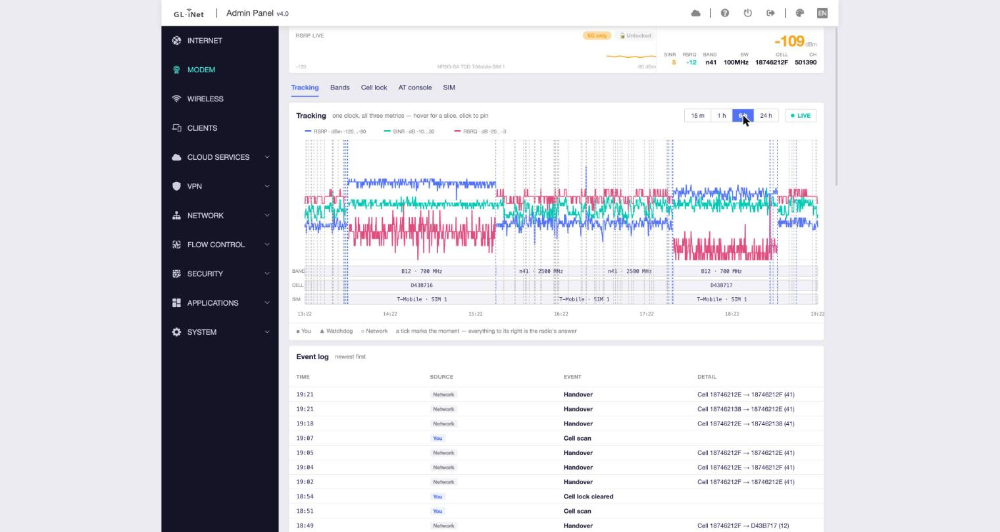
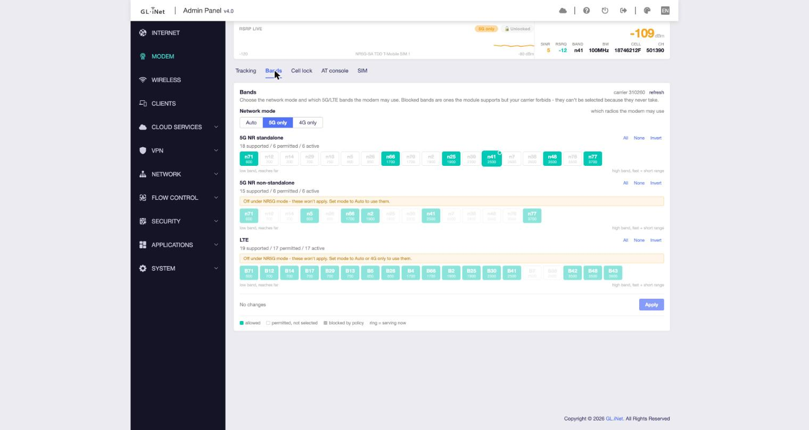
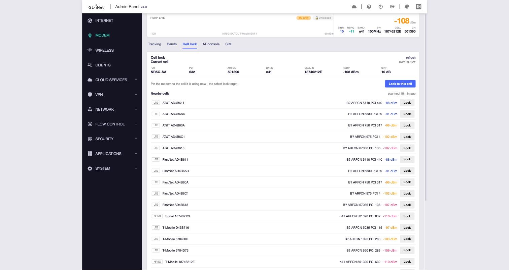
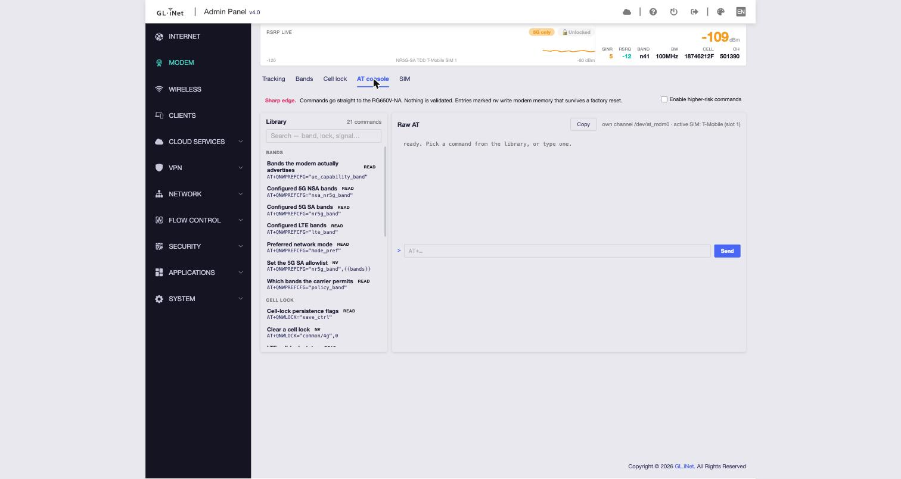
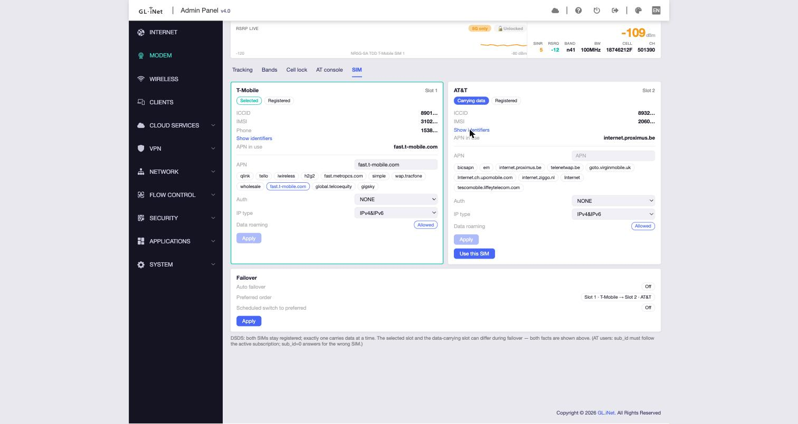

# MudiModem

A community **Modem** control panel that installs *into* the stock GL.iNet web admin of the
**GL-E5800 ("Mudi")** travel router. It adds one page alongside GL's own UI — band lock, cell lock,
live signal tracking, a raw AT console with a community command library, and DSDS SIM/APN controls —
and **patches nothing**. It ships its own files under its own names, so a GL firmware OTA can't
clobber it.

> **The pitch is not "GL can't do this."** GL ships nearly every one of these controls. The problem
> is that they are:
> 1. **Undiscoverable** — band selection is buried at Internet → SIM → dial config → *Advanced* →
>    "enable band filter." The person who hand-locked this box's bands didn't know it existed.
> 2. **Scattered** — modem controls are spread across the Internet page, modem details, SIM dialogs,
>    and a hidden signal-log view GL built and left out of the menu.
> 3. **Wrong.** GL's band dialog offers all 18 module-supported 5G bands; the carrier's policy permits
>    6. The other 12 write cleanly, report success, and never take. One AT query proves it — GL never
>    runs that query.
>
> MudiModem exists to make these controls **findable, consolidated, and honest.**

The panel appears as a top-level **MODEM** item in the GL admin nav, with five tabs.

---

## The screens

### Tracking



One clock, three metrics — RSRP, SINR, and RSRQ share a single time axis so you can see them move
together. Below the graph, lanes for **band**, **cell**, and **SIM** show exactly when the radio
changed state, and an **event log** records every band change, handover, cell lock and failover with
a timestamp and source (*You* vs *Network* vs *Watchdog*). Ranges from 15 minutes to 24 hours. The
persistent **RSRP-live status strip** across the top of every tab is the anchor — it holds the
evidence that a pending band/lock change asks a question about. Two **control-state badges** ride on
the strip's header: a **mode-lock** badge (Auto / 4G-only / 5G-only) and a **tower-lock** badge
(unlocked, or 🔒 pinned to a cell). They're muted when idle and colored when a restriction is in
force — and they read the modem's *authoritative* state over AT, so they surface a lock even when
GL's own config quietly disagrees (the shots here catch the modem in **5G-only** while GL still
reports "Auto"). Click either to jump to its tab.

### Bands



The three-layer band model, made visible: **`capability = config ∩ policy`**. Each band chip is
colored for its real state — *allowed*, *permitted-but-not-selected*, or **blocked by policy** (shown,
explained, and not selectable, because the modem will never use it no matter what GL's dialog says).
Counts read "18 supported / 6 permitted / 6 active." Network-mode selector (Auto / 5G only / 4G only)
sits on top. Writes are **confirm-or-revert**: a change arms a detached watchdog and auto-reverts in
~60 s unless you keep it, so a bad lock can't strand the cellular link you're administering over.

### Cell lock



Pin the modem to a specific PCI / ARFCN so it won't hand over. Shows the current serving cell (RAT,
PCI, ARFCN, band, cell ID, RSRP, SINR) and a scan for nearby lockable cells — **grouped by carrier
(A–Z), strongest RSRP first within each** — with a per-row Lock button. Below the list sits an honest
**Recovery** note: a kept lock lives in modem NV and survives reboot, reflash *and* factory reset, so
the panel documents the ssh panic-restore path right on the page. (A scan takes the modem offline for
up to ~10 minutes; at this location it returns only LTE neighbours.)

### AT console



A raw AT terminal to the RG650V-NA over MudiModem's **own** AT channel (`/dev/at_mdm0`), separate from
GL's polling. On the left, a searchable **community command library**: every entry carries a **risk
badge** — `read` (query only) · `set` (runtime, gone on reboot) · `nv` (**writes NV; survives factory
reset**). Nothing ever auto-runs — clicking a library entry fills the prompt. `set`/`nv` commands are
gated behind an "enable higher-risk commands" checkbox.

### SIM



Two slot cards for this DSDS box, side by side. The key honesty the stock UI hides: the **selected**
slot and the **data-carrying** slot can differ (here SIM 1 is *Selected*, SIM 2 is *Carrying data*
via failover). Each card shows identity (maskable), APN with quick-pick suggestions, auth, IP type,
and roaming state. Editable dial profile, one-click slot switch, and a failover summary. *(Identifiers
are masked in this screenshot; the "Show identifiers" toggle reveals them on the live device.)*

---

## How it works (short version)

GL's admin is an **oui**-framework Vue SPA served by nginx+lua. Pages are loaded dynamically, so a new
page is just **a view chunk + a menu JSON** — no rebuild of GL's app, no closed binary in the way.
MudiModem ships:

| File | Role |
|---|---|
| `/www/views/gl-sdk4-ui-mudimodem.common.js.gz` | the Vue page (hand-written render fns, no toolchain) |
| `/www/views/gl-sdk4-ui-mudimodem-console.common.js.gz` | the AT-console tab chunk (lazy-loaded) |
| `/usr/share/oui/menu.d/mudimodem.json` | menu registration + `global_sockets` read path |
| `/usr/lib/oui-httpd/rpc/mudimodem` | Lua backend — validated writes + AT passthrough |
| `/usr/share/gl-validator.d/mudimodem.lua` | arg validator (required once a method takes free-form AT) |
| `/usr/sbin/mudimodem-revert` | detached auto-revert watchdog + ssh panic-restore |
| `/usr/lib/mudimodem/mudimodem-at.py` | the console's own AT channel (Python stdlib, no deps) |
| `/www/mudimodem/at-library.json.gz` | the community AT library (static, axios-fetched) |

Most **reads arrive free** over GL's websocket (`global_sockets` → the `moduleStatus` getter); the Lua
backend exists mainly for **writes** (which need the dotted `cellular.*` / `modem.CPU.AT` ubus objects
the browser can't call directly) and the AT passthrough. Band writes use a confirm-or-revert watchdog
that survives nginx reloads and doubles as an ssh-callable panic restore.

See [`CLAUDE.md`](CLAUDE.md) for the full reverse-engineering notes and
[`reference/quectel-at-reference.md`](reference/quectel-at-reference.md) for the AT command knowledge
(marked verified-on-box vs. from-the-manual).

## Hardware / firmware

- **Router:** GL.iNet GL-E5800 ("Mudi"), Qualcomm SDXPINN, aarch64, GL firmware 4.8.5 / OpenWrt 23.05.4
- **Modem:** Quectel **RG650V-NA** (the NA variant), AT port `/dev/smd9`
- ⚠️ No AT manual exists for the 6-series RG650V — **the box is the only authority.** Probe read-only
  and trust it over any doc.

## Repo layout

```
src/views/mudimodem.js        ← chunk source (plain JS; gzipped at build)
src/menu/mudimodem.json       ← menu registration + global_sockets
src/at-library/<vendor>.json  ← community AT snippets
tools/build.sh                ← gzip to the shipped .common.js.gz
tools/deploy.sh               ← model-guarded push over ssh `cat` (no scp: box has no sftp-server)
tools/verify.sh               ← on-device assertions
tools/mudimodem-at.py         ← the AT channel for the console
docs/screenshots/             ← the images above
reference/                    ← nginx config, oui internals, AT reference
```

## Status

Phases 0–4 are done: hello-world chunk, read-only diagnostics, band read/write with auto-revert,
AT console + library, and the SIM/APN tab. Remaining threads: make band writes durable across a
`cellular_manager` restart, finish the cell-lock set-side, and ship an idempotent install/uninstall
that registers the files in `/etc/sysupgrade.conf`. See `CLAUDE.md` §12 for the live status.
